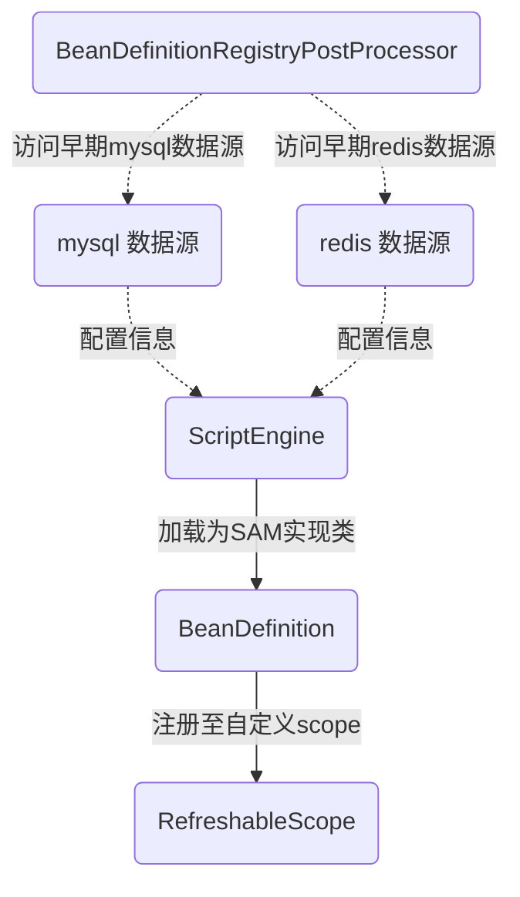

### 推其致乱之由，殆始于桓、灵二帝（背景篇）

于传统的 Spring Bean 管理模式下，通常具有以下局限性

- 强依赖编译期注解解析生成 Bean
- 无法在运行时动态加载 Bean
- 虽有 @Conditional 系列注解，支持在启动时根据规则是否生效 Bean，但也只局限于容器启动时
- 虽有 @RefreshScope 注解支持动态刷新“配置类”（原谅我这个有歧义的叫法，使用 @Value 注解读取配置信息的类），但依赖 Spring Cloud 环境，且仅局限于“配置类”

在实际开发中，有时又难免会遇到这样的场景：

- 热更新：线上服务需要动态加载新的业务逻辑类，却又不想重启应用
- 动态求值、规则引擎：业务规则高度变化，一天一个样，又不可能天天发版
- 动态定时任务：定时执行可动态变化的任务，而非是事先预定的任务
- 动态策略对象：将策略类抽象成 lambda，以达到动态加载的目的。
- Java脚本：将诸如 "()->{...}" 这样的字符串加载成一个动态对象

综上，我实现了一款轻量级的，用于构建灵活可配置的 Spring Bean，基于数据驱动（MySql/Redis）的动态 Bean 加载方案。

---

### 汝剑利，吾剑未尝不利；云愿往，飞亦愿往（原理篇一：启动时同步）

Spring 在扫描、解析配置后，以及创建 Bean 之前，会将要创建的 Bean 的元信息，生成一系列的 BeanDefinition 对象（即创建 Bean 对象的蓝图），放置在一个 Map 中，并且向外提供一个参与时机（生命周期接口 BeanDefinitionRegistryPostProcessor），允许使用者从外部参与修改该 Map 中的 BeanDefinition，在将 MyBatis 整合至 Spring Boot 中时，也是利用了此时机，扫描 Mapper，注册成代理工厂方法（MapperFactoryBean）。我们也可以利用此时机，实现在 Spring 容器启动时，读取 MySql、Redis 配置信息，使用脚本引擎解析、加载成动态类，生成 BeanDefinition，并最终注册至我们自定义的 RefreshableScope 域中，实现 Bean 对象的区域自治 。

###### 流程图：



注册 BeanDefinitionRegistryPostProcessor 代码如下：

```java
@Bean
public static BeanDefinitionRegistryPostProcessor beanDefinitionRegistryPostProcessor(Environment environment, @Qualifier("groovyGetter") Function<ClassLoader, ScriptEngine> scriptEngineGetter, RefreshableScope refreshableScope) {
    return registry -> {
        log.info("starting DatabaseMode BeanDefinitionRegistry.");
        var beanDefinitionHolders = RefreshableBeanDefinitionResolver.resolveBeanDefinitionFromDatabase(environment, scriptEngineGetter, refreshableScope);
        beanDefinitionHolders.forEach(beanDefinitionHolder -> registry.registerBeanDefinition(beanDefinitionHolder.getBeanName(), beanDefinitionHolder.getBeanDefinition()));
    };
}
```

解析配置信息生成 BeanDefinition 代码如下：

```java
@Slf4j
public class RefreshableBeanDefinitionResolver {
    // 从数据库中获取所有需要动态注册的Bean定义
    public static Set<BeanDefinitionHolder> resolveBeanDefinitionFromDatabase(Environment environment, Function<ClassLoader, ScriptEngine> scriptEngineGetter, RefreshableScope refreshableScope) {
        var jdbcTemplate = resolverEarlyJdbcTemplate(environment);
        var refreshBeanList = jdbcTemplate.query(
                "select * from refresh_bean",
                (rs, rowNum) -> new RefreshBeanModel(
                        rs.getLong("id"),
                        rs.getString("bean_name"),
                        rs.getString("lambda_script"),
                        rs.getString("description")
                ));
        return refreshBeanList.stream()
                .map(refreshBeanModel -> resolveBeanDefinitionFromModel(refreshBeanModel, scriptEngineGetter, refreshableScope))
                .peek(beanDefinitionHolder -> log.debug("register beanDefinition, {} => {}", beanDefinitionHolder.getBeanName(), beanDefinitionHolder.getBeanDefinition()))
                .collect(Collectors.toSet());
    }

    // 从Redis中获取所有需要动态注册的Bean定义
    public static Set<BeanDefinitionHolder> resolveBeanDefinitionFromRedis(Environment environment, Function<ClassLoader, ScriptEngine> scriptEngineGetter, RefreshableScope refreshableScope) {
        try (var redisClient = resolverEarlyRedisClient(environment); var connect = redisClient.connect()) {
            return connect.sync()
                    .hgetall(RedisConst.REFRESH_BEAN_KEY)
                    .values()
                    .stream()
                    .map(RefreshBeanModel::parse)
                    .map(refreshBeanModel -> resolveBeanDefinitionFromModel(refreshBeanModel, scriptEngineGetter, refreshableScope))
                    .peek(beanDefinitionHolder -> log.debug("register beanDefinition, {} => {}", beanDefinitionHolder.getBeanName(), beanDefinitionHolder.getBeanDefinition()))
                    .collect(Collectors.toSet());
        } catch (Exception e) {
            throw new RuntimeException(e);
        }
    }

    // 根据 RefreshBeanModel 创建 BeanDefinitionHolder
    public static BeanDefinitionHolder resolveBeanDefinitionFromModel(RefreshBeanModel refreshBeanModel, Function<ClassLoader, ScriptEngine> scriptEngineGetter, RefreshableScope refreshableScope) {
        var lambdaScript = refreshBeanModel.lambdaScript();
        var beanName = refreshBeanModel.beanName();
        // 每个动态类使用唯一的 ClassLoader 加载，用完即抛，防止内存泄露
        try (var classLoader = new GroovyClassLoader()) {
            var scriptEngine = scriptEngineGetter.apply(classLoader);
            var target = scriptEngine.eval(lambdaScript);
            // 注册Bean定义
            var beanDefinition = BeanDefinitionBuilder
                    .genericBeanDefinition(SAMProxyFactoryBean.class)
                    .addConstructorArgValue(target)
                    .setScope(refreshableScope.name())
                    .getBeanDefinition();
            return new BeanDefinitionHolder(beanDefinition, beanName);
        } catch (Exception e) {
            throw new RuntimeException(e);
        }
    }

    // 获取 Early JdbcTemplate
    private static JdbcTemplate resolverEarlyJdbcTemplate(Environment environment) {
        log.debug("Starting to access the early datasource.");
        var url = environment.getProperty("spring.datasource.url");
        var username = environment.getProperty("spring.datasource.username");
        var password = environment.getProperty("spring.datasource.password", "");
        var dataSource = new DriverManagerDataSource(url, username, password);
        return new JdbcTemplate(dataSource);
    }

    // 获取 Early RedisClient
    private static RedisClient resolverEarlyRedisClient(Environment environment) {
        log.debug("Starting to access the early redis.");
        var host = environment.getProperty("spring.data.redis.host");
        var port = environment.getProperty("spring.data.redis.port", Integer.class);
        var password = environment.getProperty("spring.data.redis.password");
        var builder = RedisURI.builder()
                .withHost(host)
                .withPort(port)
                .withDatabase(0);
        if (Assert.strNotBlank(password)) builder.withPassword((CharSequence) password);
        var redisUri = builder.build();
        return RedisClient.create(redisUri);
    }
}
```


自定义作用域，实现如下：

```java
// 自定义域对象，存储 RefreshAble Bean
public class RefreshableScope implements Scope {

    private final Map<String, FactoryBean<SAM<?, ?>>> factoryBeanCache = new ConcurrentHashMap<>();

    public String name() {
        return "REFRESHABLE_SCOPE";
    }

    @NonNull
    @Override
    @SuppressWarnings("unchecked")
    public FactoryBean<SAM<?, ?>> get(@NonNull String name, @NonNull ObjectFactory<?> objectFactory) {
        return factoryBeanCache.computeIfAbsent(name, key -> (FactoryBean<SAM<?, ?>>) objectFactory.getObject());
    }

    @NonNull
    @Override
    public Object remove(@NonNull String name) {
        return factoryBeanCache.remove(name);
    }
}
```

以上，忽略部分实现，完成了在 Spring 启动时读取 MySql 、Redis 中的配置信息，动态注册 BeanDefinition 的功能，Spring 在进行至创建 Bean 实例流程时，会创建该动态类的代理对象，并将对象注册至 RefreshableScope 中，由我们来料其生死。

---

### 云长恐有他变，不敢下马，用青龙刀尖挑锦袍披于身上，勒马回头称谢曰：“蒙丞相赐袍，异日更得相会。”（原理篇二：运行时更新）

在运行时，增删改 Bean，我提供了以下三个 mode 可供选择：

- database：提供一套增删改数据库配置的接口，在操作 mysql 配置表的同时，发布事件异步处理 Bean 实例以及 BeanDefinition 的增删改。

- redis：提供一套增删改数据库配置的接口，在操作 redis hset 的同时，发布事件异步处理 Bean 实例以及 BeanDefinition 的增删改。

- database-auto：使用 canal 监听 mysql 配置表的增删改，解析 mysql binlog 增量日志，修改表数据时，通过长轮询自动触发 Bean 实例及 BeanDefinition 后续操作，无需手动调用接口。
- redis-auto：暂未提供。【画外音，redis pubsub（ keyspace notifications）：关某自随兄长征战，许多年来，未尝落后。今日逢大敌，军师却不委用，此是何意？】

database mode 接口代码如下：

```java
@Service
@RequiredArgsConstructor
@ConditionalOnProperty(name = "dynamic-bean.mode", havingValue = "database")
public class RefreshBeanServiceDatabaseImpl implements RefreshBeanService {

    private final ApplicationEventPublisher applicationEventPublisher;

    private final RefreshBeanMapper refreshBeanMapper;

    @Override
    public List<RefreshBeanModel> selectAll() {
        return refreshBeanMapper.selectAll();
    }

    @Override
    @Transactional
    public int insert(RefreshBeanModel refreshBeanModel) {
        var beanName = refreshBeanModel.beanName();
        refreshBeanMapper.selectOne(beanName).ifPresent(rbm -> {
            throw new IllegalArgumentException("model already exists");
        });
        var result = refreshBeanMapper.insert(refreshBeanModel);
        refresh(RefreshBeanEvent.addWith(refreshBeanModel));
        return result;
    }

    @Override
    @Transactional
    public int update(RefreshBeanModel refreshBeanModel) {
        var beforeModel = refreshBeanMapper.selectOne(refreshBeanModel.beanName())
                .orElseThrow(() -> new NoSuchElementException("model not found"));
        var result = refreshBeanMapper.update(refreshBeanModel);
        var afterModel = refreshBeanMapper.selectOne(refreshBeanModel.beanName())
                .orElseThrow(() -> new NoSuchElementException("model not found"));
        // 当修改了 lambdaScript 时，才触发后续的刷新操作
        if (beforeModel.diff(afterModel)) refresh(RefreshBeanEvent.updateWith(beforeModel, afterModel));
        return result;
    }

    @Override
    @Transactional
    public int delete(String beanName) {
        refreshBeanMapper.selectOne(beanName).orElseThrow(() -> new NoSuchElementException("model not found"));
        var result = refreshBeanMapper.delete(beanName);
        refresh(RefreshBeanEvent.deleteWith(RefreshBeanModel.withBeanName(beanName)));
        return result;
    }

    private void refresh(RefreshBeanEvent refreshBeanEvent) {
        applicationEventPublisher.publishEvent(refreshBeanEvent);
    }
}
```

redis mode 接口代码如下：

```java
@Service
@ConditionalOnProperty(name = "dynamic-bean.mode", havingValue = "redis")
public class RefreshBeanServiceRedisImpl implements RefreshBeanService {
    private final RedisTemplate<String, String> redisTemplate;
    private final ApplicationEventPublisher applicationEventPublisher;

    public RefreshBeanServiceRedisImpl(@Qualifier("stringRedisTemplate") RedisTemplate<String, String> redisTemplate, ApplicationEventPublisher applicationEventPublisher) {
        this.redisTemplate = redisTemplate;
        this.applicationEventPublisher = applicationEventPublisher;
    }

    @Override
    public List<RefreshBeanModel> selectAll() {
        HashOperations<String, String, String> hashOperations = redisTemplate.opsForHash();
        var jsonStrList = hashOperations.entries(RedisConst.REFRESH_BEAN_KEY).values();
        return parseList(jsonStrList);
    }

    @Override
    @Transactional
    public int insert(RefreshBeanModel refreshBeanModel) {
        var beanName = refreshBeanModel.beanName();
        HashOperations<String, String, String> hashOperations = redisTemplate.opsForHash();
        Assert.isFalse(RedisConst.REFRESH_BEAN_KEY, beanName, hashOperations::hasKey, () -> new IllegalArgumentException("model already exists"));
        hashOperations.put(RedisConst.REFRESH_BEAN_KEY, beanName, refreshBeanModel.toJson());
        refresh(RefreshBeanEvent.addWith(refreshBeanModel));
        return 1;
    }

    @Override
    @Transactional
    public int update(RefreshBeanModel refreshBeanModel) {
        var beanName = refreshBeanModel.beanName();
        HashOperations<String, String, String> hashOperations = redisTemplate.opsForHash();
        Assert.isTrue(RedisConst.REFRESH_BEAN_KEY, beanName, hashOperations::hasKey, () -> new NoSuchElementException("model not exists"));
        var beforeModel = RefreshBeanModel.parse(hashOperations.get(RedisConst.REFRESH_BEAN_KEY, beanName));
        hashOperations.put(RedisConst.REFRESH_BEAN_KEY, beanName, refreshBeanModel.toJson());
        refresh(RefreshBeanEvent.updateWith(beforeModel, refreshBeanModel));
        return 1;
    }

    @Override
    @Transactional
    public int delete(String beanName) {
        HashOperations<String, String, String> hashOperations = redisTemplate.opsForHash();
        Assert.isTrue(RedisConst.REFRESH_BEAN_KEY, beanName, hashOperations::hasKey, () -> new NoSuchElementException("model not exists"));
        hashOperations.delete(RedisConst.REFRESH_BEAN_KEY, beanName);
        refresh(RefreshBeanEvent.deleteWith(RefreshBeanModel.withBeanName(beanName)));
        return 1;
    }

    private List<RefreshBeanModel> parseList(Collection<String> jsonList) {
        return jsonList.stream().map(RefreshBeanModel::parse).toList();
    }

    private void refresh(RefreshBeanEvent refreshBeanEvent) {
        applicationEventPublisher.publishEvent(refreshBeanEvent);
    }
}
```

spring 事件监听器配置，如下：

```java
@Async
@TransactionalEventListener(RefreshBeanEvent.class)
public void eventListener(RefreshBeanEvent refreshBeanEvent) {
    new DefaultEventProcessor(defaultListableBeanFactory, refreshableScope, scriptEngineGetter)
            .processEvent(refreshBeanEvent);
}
```

事件处理器，如下：

```java
@Slf4j
@RequiredArgsConstructor
public class DefaultEventProcessor implements EventProcessor {
    private final DefaultListableBeanFactory defaultListableBeanFactory;

    private final RefreshableScope refreshableScope;

    private final Function<ClassLoader, ScriptEngine> scriptEngineGetter;

    @Override
    public void processEvent(RefreshBeanEvent refreshBeanEvent) {
        // 更新时已使用 LinkedHashMap，保证先消费 DEL，后消费 ADD
        refreshBeanEvent.getSource()
                .forEach((eventType, refreshBeanModel) -> {
                    switch (eventType) {
                        case DEL -> del(refreshBeanModel);
                        case ADD -> add(refreshBeanModel);
                        default -> throw new IllegalArgumentException("unknown event type");
                    }
                });
    }

    // 新增时，注册 BeanDefinition
    private void add(RefreshBeanModel refreshBeanModel) {
        try {
            var beanName = refreshBeanModel.beanName();
            var beanDefinition = defaultListableBeanFactory.getBeanDefinition(beanName);
            // 存在时，抛出 IllegalArgumentException 异常
            Assert.isTrue(beanDefinition, Assert::isNull, () -> new IllegalArgumentException("beanDefinition already exists"));
        } catch (NoSuchBeanDefinitionException e) {
            // 不存在时，注册 BeanDefinition
            var beanDefinitionHolder = RefreshableBeanDefinitionResolver.resolveBeanDefinitionFromModel(refreshBeanModel, scriptEngineGetter, refreshableScope);
            defaultListableBeanFactory.registerBeanDefinition(beanDefinitionHolder.getBeanName(), beanDefinitionHolder.getBeanDefinition());
            log.info("add beanDefinition: {}", beanDefinitionHolder.getBeanName());
        }
    }

    // 删除时，删除 Bean实例, 并删除 BeanDefinition。
    private void del(RefreshBeanModel refreshBeanModel) {
        var beanName = refreshBeanModel.beanName();
        var beanDefinition = defaultListableBeanFactory.getBeanDefinition(beanName);
        Assert.isTrue(beanDefinition, Assert::isNotNull, () -> new NoSuchElementException("beanDefinition not found"));
        refreshableScope.remove(refreshBeanModel.beanName());
        defaultListableBeanFactory.removeBeanDefinition(refreshBeanModel.beanName());
        log.info("del beanDefinition: {}", beanName);
    }
}
```

database-auto mode 下，通过一个 canalConnector 长链接轮询表的增删改事件，在操作 mysql 表时，自动同步处理 spring bean 以及 BeanDefinition。

```java
@Slf4j
@RequiredArgsConstructor
public class CanalClientListener {

    private final CanalConnector canalConnector;

    private final ApplicationEventPublisher applicationEventPublisher;

    private static final Map<String, Integer> constructorMap = Map.of(
            "id", 0,
            "bean_name", 1,
            "lambda_script", 2,
            "description", 3
    );
    @SuppressWarnings("InfiniteLoopStatement")
    public void startListener() {
        while (true) {
            try {
                var message = canalConnector.getWithoutAck(1000);
                var batchId = message.getId();
                var size = message.getEntries().size();
                if (batchId == -1 || size == 0) {
                    TimeUnit.SECONDS.sleep(1);
                    continue;
                }
                processMessage(message);
                canalConnector.ack(batchId);
            } catch (Exception e) {
                log.error("canal client error: ", e);
                canalConnector.rollback();
            }
        }
    }

    private void processMessage(Message message) {
        message.getEntries()
                .stream()
                .filter(entry -> entry.getEntryType() == CanalEntry.EntryType.ROWDATA)
                .forEach(this::processEntry);
    }

    private void processEntry(CanalEntry.Entry entry) {
        try {
            var rowChange = CanalEntry.RowChange.parseFrom(entry.getStoreValue());
            var eventType = rowChange.getEventType();
            rowChange.getRowDatasList()
                    .forEach(rowData -> processRowData(eventType, rowData));
        } catch (InvalidProtocolBufferException e) {
            throw new RuntimeException(e);
        }
    }

    private void processRowData(CanalEntry.EventType eventType, CanalEntry.RowData rowData) {
        switch (eventType) {
            case INSERT -> handleInsert(rowData.getAfterColumnsList());
            case UPDATE -> handleUpdate(rowData.getBeforeColumnsList(), rowData.getAfterColumnsList());
            case DELETE -> handleDelete(rowData.getBeforeColumnsList());
            default -> {// 忽略其他事件
            }
        }
    }

    private RefreshBeanModel mapToModel(List<CanalEntry.Column> columns) {
        var array = new String[4];
        columns.forEach(column -> {
            var name = column.getName();
            var value = column.getValue();
            var index = constructorMap.get(name);
            array[index] = value;
        });
        return new RefreshBeanModel(Long.valueOf(array[0]), array[1], array[2], array[3]);
    }

    // 处理新增数据
    private void handleInsert(List<CanalEntry.Column> columns) {
        var refreshBeanModel = mapToModel(columns);
        log.info("Insert:{}", refreshBeanModel);
        applicationEventPublisher.publishEvent(RefreshBeanEvent.addWith(refreshBeanModel));
    }

    // 处理更新数据
    private void handleUpdate(List<CanalEntry.Column> before, List<CanalEntry.Column> after) {
        var beforeModel = mapToModel(before);
        var afterModel = mapToModel(after);
        log.info("Update - before:{} after:{}", beforeModel, afterModel);
        applicationEventPublisher.publishEvent(RefreshBeanEvent.updateWith(beforeModel, afterModel));
    }

    // 处理删除数据
    private void handleDelete(List<CanalEntry.Column> columns) {
        var refreshBeanModel = mapToModel(columns);
        log.info("Delete:{}", refreshBeanModel);
        applicationEventPublisher.publishEvent(RefreshBeanEvent.deleteWith(refreshBeanModel));
    }
}
```

---

### 豫州当日叹孤穷，何幸南阳有卧龙！欲识他年分鼎处，先生笑指画图中。（配置篇）

配置示例，如下

```yaml
spring:
  application:
    name: dynamic-bean
  datasource:
    url: jdbc:mysql://192.168.33.128:3306/dynamic_bean?useUnicode=true&characterEncoding=utf-8&useSSL=false&serverTimezone=UTC
    username: root
    password: root
    driver-class-name: com.mysql.cj.jdbc.Driver
    type: com.zaxxer.hikari.HikariDataSource
    hikari:
      pool-name: dynamic-bean-hikari
      idle-timeout: 600000
      max-lifetime: 1800000
      minimum-idle: 5
      maximum-pool-size: 10
      validation-timeout: 5000
  data:
    redis:
      host: 192.168.33.128
      port: 6379

logging:
  level:
    org.mybatis: info

# 需自行提供 canal环境,没有可以不用配置，选用 database 或者 redis 模式
canal:
  server-host: 192.168.33.128
  server-port: 11111
  destination: example
  username: canal
  password: canal
  subscribe-filter: dynamic_bean.refresh_bean

dynamic-bean:
  mode: database #database || redis || database-auto
```

先行执行，项目中提供的 schema 下的，dynamic_bean.redis 和 dynamic_bean.sql

###### mysql 模式配置信息:

```sql
CREATE TABLE `refresh_bean` (
                                `id` int NOT NULL AUTO_INCREMENT COMMENT '主键',
                                `bean_name` varchar(32) CHARACTER SET utf8mb4 COLLATE utf8mb4_0900_ai_ci NOT NULL COMMENT 'bean在内存中名字',
                                `lambda_script` text CHARACTER SET utf8mb4 COLLATE utf8mb4_0900_ai_ci NOT NULL COMMENT 'SAM类源码',
                                `description` varchar(32) CHARACTER SET utf8mb4 COLLATE utf8mb4_0900_ai_ci NOT NULL COMMENT '描述信息',
                                PRIMARY KEY (`id`)
) ENGINE = InnoDB CHARACTER SET = utf8mb4 COLLATE = utf8mb4_0900_ai_ci ROW_FORMAT = Dynamic;

INSERT INTO `refresh_bean` VALUES (1, 'runnable-task', 'return { param -> println \"Runnable running ...\" } as shop.zailushang.spring.boot.framework.SAM', '任务型接口示例：无参无返回值');
INSERT INTO `refresh_bean` VALUES (2, 'consumer-task', 'return { param -> println \"Hello $param\" } as shop.zailushang.spring.boot.framework.SAM', '消费型接口示例：单参无返回值');
INSERT INTO `refresh_bean` VALUES (3, 'supplier-task', 'return { param -> \"zailushang\"} as shop.zailushang.spring.boot.framework.SAM', '供给型接口示例：无参带返回值');
INSERT INTO `refresh_bean` VALUES (4, 'function-task', 'return { param -> param.replace(\"PHP\",\"Java\") } as shop.zailushang.spring.boot.framework.SAM', '函数型接口示例：单参带返回值（任意）');
INSERT INTO `refresh_bean` VALUES (5, 'predicate-task', 'return { param -> \"gay\" == param } as shop.zailushang.spring.boot.framework.SAM', '断言型接口示例：单参带返回值（Boolean）');
INSERT INTO `refresh_bean` VALUES (6, 'run-4-act', 'import javax.sql.DataSource;return { param -> println act.getBean(DataSource.class) } as shop.zailushang.spring.boot.framework.SAM', '使用内置对象 act 查找依赖示例');
INSERT INTO `refresh_bean` VALUES (7, 'run-4-itl', 'return { param -> println \"itl.get() = ${itl.get()}, in groovy.\"; itl.remove(); } as shop.zailushang.spring.boot.framework.SAM', '使用内置对象 itl 获取线程变量示例');
```

###### redis 模式配置信息

```redis
HSET "$_____refresh_bean_____$"
"runnable-task" '{"id":"","beanName":"runnable-task","lambdaScript":"return { param -> println \"Runnable running ...\" } as shop.zailushang.spring.boot.framework.SAM","description":"任务型接口示例：无参无返回值"}'
  "consumer-task" '{"id":"","beanName":"consumer-task","lambdaScript":"return { param -> println \"Hello $param\" } as shop.zailushang.spring.boot.framework.SAM","description":"消费型接口示例：单参无返回值"}'
  "supplier-task" '{"id":"","beanName":"supplier-task","lambdaScript":"return { param -> \"zailushang\"} as shop.zailushang.spring.boot.framework.SAM","description":"供给型接口示例：无参带返回值"}'
  "function-task" '{"id":"","beanName":"function-task","lambdaScript":"return { param -> param.replace(\"PHP\",\"Java\") } as shop.zailushang.spring.boot.framework.SAM","description":"函数型接口示例：单参带返回值（任意）"}'
  "predicate-task" '{"id":"","beanName":"predicate-task","lambdaScript":"return { param -> \"gay\" == param } as shop.zailushang.spring.boot.framework.SAM","description":"断言型接口示例：单参带返回值（Boolean）"}'
  "run-4-act" '{"id":"","beanName":"run-4-act","lambdaScript":"import javax.sql.DataSource;return { param -> println act.getBean(DataSource.class) } as shop.zailushang.spring.boot.framework.SAM","description":"使用内置对象 act 查找依赖示例"}'
  "run-4-itl" '{"id":"","beanName":"run-4-itl","lambdaScript":"return { param -> println \"itl.get() = ${itl.get()}, in groovy.\"; itl.remove(); } as shop.zailushang.spring.boot.framework.SAM","description":"使用内置对象 itl 获取线程变量示例"}'
```

Tip：其中，id 字段不重要，不承载业务，所以，mysql 中简单自增就行，redis 中可以不存。承载实际增删改业务的逻辑主键为 bean_name，要求唯一，且不可修改 bean_name，如想修改 bean_name，正确做法是删除后新增。

以上 lambda_script 字段中存储的为 Groovy 脚本，格式如下:

```groovy
return { param ->
    ...// 更详细的使用示例见：启动篇
} as shop.zailushang.spring.boot.framework.SAM
```

Groovy 脚本环境已绑定的上下文级变量，代码如下：

```java
// groovy 脚本环境下绑定此 InheritableThreadLocal 进行个性化参数传递
@Bean("inheritableThreadLocal")
public static InheritableThreadLocal<Object> inheritableThreadLocal() {
    return new InheritableThreadLocal<>();
}

// groovy 脚本引擎
@Bean("groovyGetter")
@DependsOn("inheritableThreadLocal")
public static Function<ClassLoader, ScriptEngine> scriptEngineGetter(ApplicationContext applicationContext, @Qualifier("inheritableThreadLocal") InheritableThreadLocal<Object> inheritableThreadLocal) {
    return classLoader -> {
        var scriptEngineManager = new ScriptEngineManager(classLoader);
        var groovy = scriptEngineManager.getEngineByName("groovy");
        var context = groovy.getContext();
        // 绑定上下文对象
        context.setAttribute("act", applicationContext, ScriptContext.ENGINE_SCOPE);
        context.setAttribute("itl", inheritableThreadLocal, ScriptContext.ENGINE_SCOPE);
        return groovy;
    };
}
```

为什么选择使用 Groovy?

Groovy 同属 JVM 语言，高度兼容 Java 代码，与 Java 代码无缝互操作，其本身具有动态语言特性：动态类型，元编程能力、允许在运行时修改类或方法，可以轻松用于构建 DSL，我愿称其为 the real java script。使用其，可以很轻松的实现将类似 "()->{}" 这样的字符串加载成动态类的功能。

关于 Groovy 中的 SAM（Single Abstract Method），即单一抽象方法，对应 Java 中的 @FunctionalInterface，我已将常见的函数式接口封装成以下统一的实现，通过 Groovy 加载脚本解析加载的动态类，最终都会被加载成一个 SAM 的实现类。

```java
// 单一抽象方法
@FunctionalInterface
public interface SAM<T, R> extends Runnable, Consumer<T>, Supplier<R>, Function<T, R>, Predicate<T> {

    @Override
    default void run() {
        execute(null);
    }

    @Override
    default void accept(T param) {
        execute(param);
    }

    @Override
    default R get() {
        return execute(null);
    }

    @Override
    default R apply(T param) {
        return execute(param);
    }

    @Override
    default boolean test(T param) {
        return (boolean) execute(param);
    }

    R execute(T param);
}
```

lambdaScript 注册为 BeanDefinition 时的真正实现类：

```java
@RequiredArgsConstructor
public class SAMProxyFactoryBean<T, R> implements FactoryBean<SAM<T, R>> {

    private final SAM<T, R> target;
    // 缓存代理实例
    private volatile SAM<T, R> proxy;

    @NonNull
    @Override
    public SAM<T, R> getObject() {
        if (proxy == null) {
            // FactoryBean 的 this 已在 scope 中缓存，所以这里使用 this 作为锁对象无碍
            synchronized (this) {
                if (proxy == null) proxy = createProxy();
            }
        }
        return proxy;
    }

    // 使用 jdk 动态代理生成代理对象
    @SuppressWarnings("unchecked")
    private SAM<T, R> createProxy() {
        return (SAM<T, R>) Proxy.newProxyInstance(
                SAM.class.getClassLoader(),
                new Class[]{SAM.class},
                (proxy, method, args) -> method.invoke(target, args));
    }

    @NonNull
    @Override
    public Class<?> getObjectType() {
        return SAM.class;
    }
}
```

---

### 待某去屋后放一把火，却看他起也不起？（启动篇）

功能性测试示例，演示如下：

```java
@SpringBootTest
@SuppressWarnings("unchecked")
public class DatabaseLambdaScriptTests {
    @Autowired
    private ApplicationContext applicationContext;

    // 测试 Runnable 类型任务 任务id 1
    @Test
    void runnableTest() {
        var runnable = applicationContext.getBean("runnable-task", Runnable.class);
        runnable.run();
    }

    // 测试 Consumer 类型任务 任务id 2
    @Test
    void consumerTest() {
        var consumer = applicationContext.getBean("consumer-task", Consumer.class);
        var name = "zailushang";
        consumer.accept(name);
    }

    // 测试 Supplier 类型任务 任务id 3
    @Test
    void supplierTest() {
        Supplier<String> supplier = applicationContext.getBean("supplier-task", Supplier.class);
        var name = supplier.get();
        System.out.println("your name is " + name);
    }

    // 测试 Function 类型任务 任务id 4
    @Test
    void functionTest() {
        Function<String, String> function = applicationContext.getBean("function-task", Function.class);
        var no = "make PHP great again.";
        var yes = function.apply(no);
        System.out.println(yes);
    }

    // 测试 Predicate 类型任务 任务id 5
    @Test
    void predicateTest() {
        Predicate<String> predicate = applicationContext.getBean("predicate-task", Predicate.class);
        var gender = "gay";
        boolean isBadGender = predicate.test(gender);
        System.out.println("is a bad gender? " + (isBadGender ? "yes" : "no"));
    }

    // 测试 使用act查找依赖 任务id 6
    @Test
    void injectTest() {
        var runnable = applicationContext.getBean("run-4-act", Runnable.class);
        runnable.run();
    }

    // 测试 使用InheritableThreadLocal传递线程变量 任务id 7
    @Test
    void threadLocalTest() {
        var inheritableThreadLocal = applicationContext.getBean(InheritableThreadLocal.class);
        inheritableThreadLocal.set("zailushang");
        System.out.println("before : " + inheritableThreadLocal.get());
        var runnable = applicationContext.getBean("run-4-itl", Runnable.class);
        runnable.run();
        System.out.println("after : " + inheritableThreadLocal.get());
    }
}
```

接口测试示例，如下：

```
### 获取数据库或redis中的所有 refreshBean 列表
GET http://localhost:8080/refreshBean/list


### 获取内存中已注册的 refreshBean类型的 所有beanName
GET http://localhost:8080/beans


### 新增 bean
POST http://localhost:8080/refreshBean
Content-Type: application/json

{
  "beanName": "run-test",
  "lambdaScript": "return { param -> println \"test running ...\" } as shop.zailushang.spring.boot.framework.SAM",
  "description": "test任务"
}


### 测试运行 bean
GET http://localhost:8080/run/run-test


### 修改bean，beanName 不允许修改
PUT http://localhost:8080/refreshBean
Content-Type: application/json

{
  "beanName": "run-test",
  "lambdaScript": "return { param -> println \"test running 11111111...\" } as shop.zailushang.spring.boot.framework.SAM",
  "description": "test任务1111"
}


### 删除bean
DELETE http://localhost:8080/refreshBean/run-test
```

groovy 脚本环境下，绑定参数的使用示例

```groovy
// 或在此导包，或使用全限定类名
import shop.zailushang.spring.boot.framework.SAM;
return { param ->
    // 此处可无缝使用 java 类，不了解 groovy 语法也没关系，这里可以完全当 java 来写
    // 除入参 param 外，此处还额外绑定了上下文级的变量 act（ApplicationContext） 用以获取 spring 内部的任意 bean 对象
    // 变量 itl （InheritableThreadLocal）用以实现线程隔离传参，见测试案例任务id 7
    def xxx = act.getBean("bean名字", XXX.class) // 根据实际情况选择在上面导包或者使用全限定类名，任务6为依赖查找示例
    def xxx = itl.get() // 任务7为使用InheritableThreadLocal传参示例，注意使用完在 finally 块中移除，防止内存泄露
} as SAM
```

编写脚本时，可以这样做：

```
// 在任意类中声名一个这样的方法体，在其中编写业务逻辑，
Object xx(ApplicationContext act, InheritableThreadLocal<Object> itl, Ojbect param){
	// 此处使用的类如需导包，在脚本环境下也需要进行相应的导包处理
	// 除此之外，只需将此方法的方法体原封不动的拷贝至下面即可
	// 此处的 param 类型，以及返回值类型，可以是任意类型，取决于你想使用什么参数，就按照什么类型来处理，使用时你按处理时的类型传参即可
	// 返回值同理，你这里返回什么类型，就在使用时，用对应的类型去接收
}


import xxx.xxx.xxx;
return { param ->
	// 嵌入方法体
} as shop.zailushang.spring.boot.framework.SAM
```

项目中使用动态 Bean 示例：

```java
// 不建议的用法，动态 bean 和一个静态 bean 绑定
@Component
public class TestClass {
    @Autowired
    @Qualifier("bean名字")
    private Sam<?,?> sam;
}

// 建议的用法，通过 ApplicationContext 查找
public class TestClass {
    public void xxx(){
        var bean = ApplicationContext.getBean("bean名字",SAM.class);
        // bean 已经实现了大多数函数式接口 参考任务 1-5 示例
    }
}
```

---

### 不求同年同月同日生，只愿同年同月同日死。皇天后土，实鉴此心，背义忘恩，天人共戮！（兄弟篇）

配合此篇[动态定时任务](https://blog.csdn.net/qq_40553917/article/details/121879588)食用，可实现真正意义上的动态定时任务，任务可动态变化。

---

### 岁在甲子，天下大吉（完结篇）

[源码](https://github.com/github-zailushang/dynamic-bean-spring-boot-starter)已托管，数据库存储代码，或可能存在注入风险，System.exit(0);  不过话说回来，如果攻击者都能操作你的数据库了，也犯不着再在数据库中再注什么内存马了，风险需自行评估。THE END。